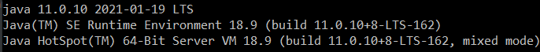
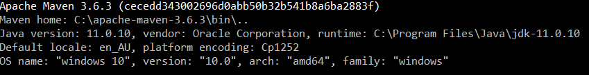
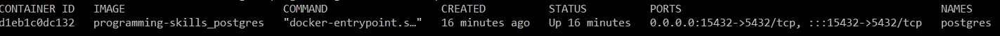

# programming-skills

# Installation

To deploy this application, it is important to have:
* Internet connection
* Docker
* Java JDK 11
* Maven

## Installing Docker

1. You need to have docker in you computer. If don't, please follow the next tutorial:
    * https://docs.docker.com/docker-for-windows/install/   
    * https://docs.docker.com/engine/install/#server
    
2. Go to the main folder `..\programming-skills` where the DockerFile is located.

3. Run the te next command as follows in a command line shell:
    * ``docker-compose up -d`` 
    This will create a container with all the necessary components to run a local database

## Installing Java 11

1. Install Java from https://www.oracle.com/co/java/technologies/javase-jdk11-downloads.html and select the one you prefer to your S.O. You can also follow the following videos to install Java 11 on different S.O.:
    * https://www.youtube.com/watch?v=1ZbHHLobt8A&t=7s (WINDOWS)
    * https://youtu.be/72mz0-98vg8?t=35 (LINUX)

2. Check that you have installed Java correctly by typing the following command line on a Command prompt:
    * java --version
      

## Installing Maven

1. Install maven from https://maven.apache.org/download.cgi and select the one you prefer to your S.O. You can also follow the following videos to install Maven on different S.O.:

    * https://youtu.be/6AVC3X88z6E?t=150 (WINDOWS)
    * https://www.youtube.com/watch?v=i8hSPwXZ0UI (LINUX)

2. checks that you have installed maven correctly by typing the following command line on a Command prompt:

    * mvn --version
      

You have to be on the folder of the project and be able to see the pom.xml file. With that, open a command prompt and execute the follow command:

    * mvn clean install

After the command line have finished, you have to execute the next command line as follows:

    * mvn spring-boot:run

NOTE: make sure that the docker container is up an running with the command line `docker ps`, you should be able to se something like this:
      
